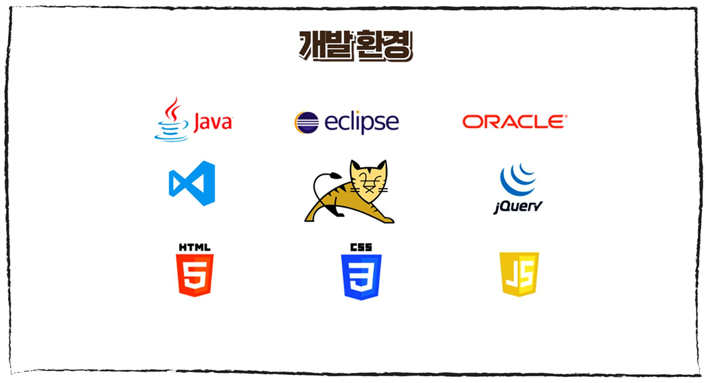
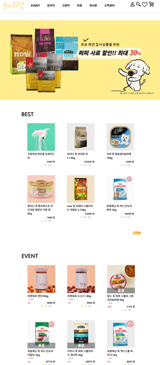
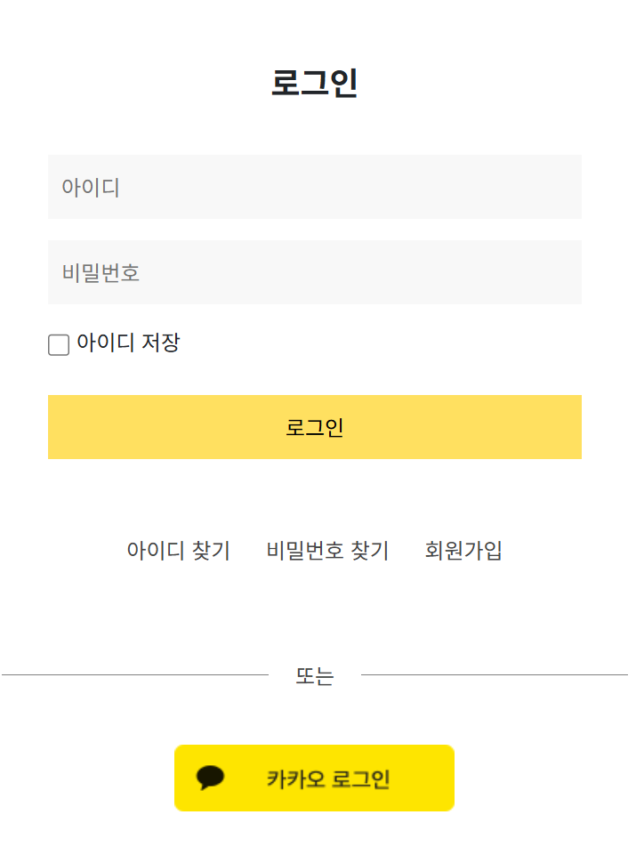
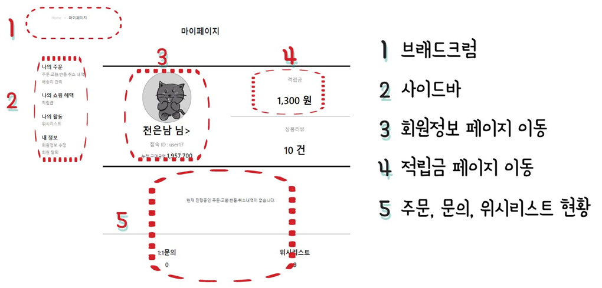
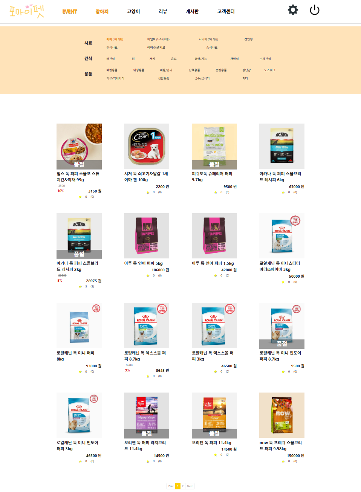
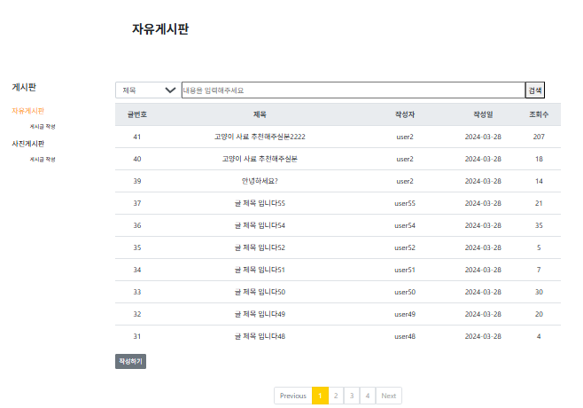
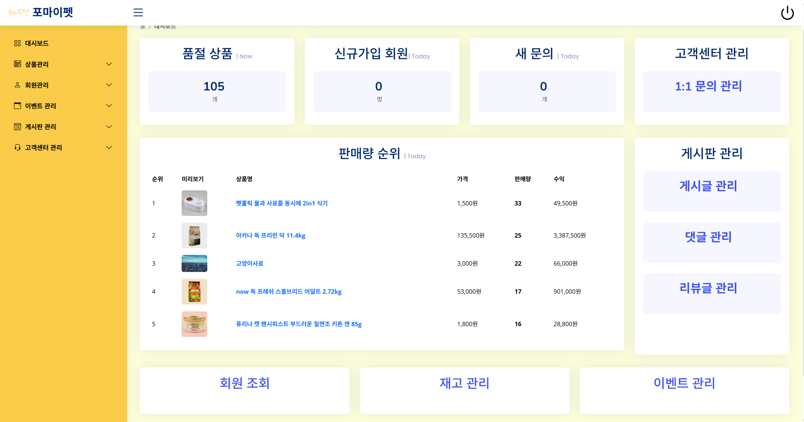
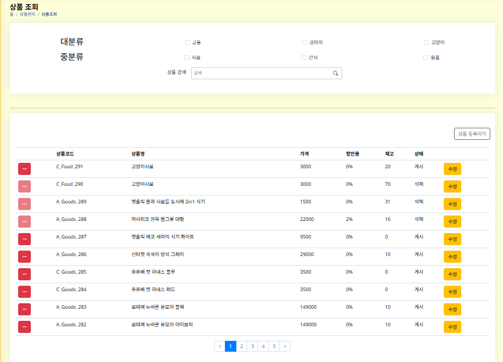
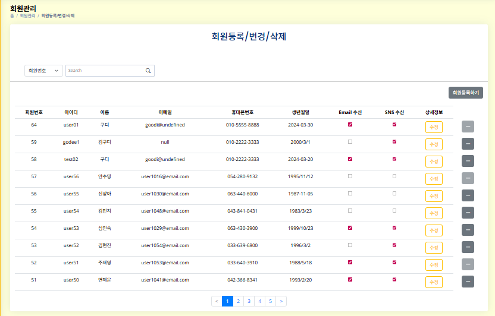

# formypet(포마이펫)

# 목차
1. [👋 소개](#소개)
2. [🛠️ 개발환경](#️개발환경)
3. [🎯 주요 기능](#주요-기능)
   1. [사용자](#사용자)
      1. [메인화면](#메인화면)
      2. [로그인](#로그인)
      3. [마이페이지](#마이페이지)
      4. [상품 조회](#상품-조회)
      5. [게시판](#게시판)
   2. [관리자](#관리자)
      1. [✨ 관리자 메인화면](#관리자-메인화면)
      2. [상품 관리](#상품-관리재고-관리상품-조회-등록-수정-삭제)
      3. [회원 관리](#회원-관리회원-조회-등록-수정-삭제)
      4. [✨ 고객센터 관리](#고객센터-관리공지사항faq11문의)
      5. [✨ 게시판 관리](#게시판-관리게시글댓글리뷰)
     
  

# 👋소개
> 첫 프로젝트이자 첫 협업 프로젝트로 Java, JSP를 활용한 Servlet 기반 반려동물 용품 쇼핑몰 사이트입니다.  
> 반려동물의 나이, 체질, 몸무게에 맞는 맞춤형 상품과 반려동물을 키우는 사람들 간의 정보공유를 위한 커뮤니티를 제공하고자 하였습니다.

 

# 🛠️개발환경

 

# 🎯주요 기능
(담당한 기능은 ✨로 표시)

## 사용자

### 메인화면

<em>▲ 메인 화면</em>

- 이벤트 배너 
- 베스트 상품과 이벤트 상품 확인 가능

 

### 로그인

<em>▲ 로그인 화면</em>

- 로그인 & 카카오 간편 로그인 기능
- 회원가입
- 아이디 및 비밀번호 찾기

 

### 마이페이지

<em>▲ 마이페이지 화면</em>

- 회원정보 수정 및 탈퇴
- 주문, 문의, 위시리스트 내역 확인
- 적립금 내역 확인

 

### 상품 조회

<em>▲ 상품 페이지</em>

- 선택한 키워드에 맞는 필터링 조회

 

### 게시판

<em>▲ 게시판 中 자유게시판</em>

- 게시글 조회/등록/수정/삭제
- 댓글 기능
- 사진 게시판에는 사진 업로드

 

## 관리자

### ✨관리자 메인화면

<em>▲ 관리자 메인화면</em>

- 판매량 top 5, 품절 상품 개수, 신규 가입 회원수, 새 문의 수 조회
- 각 관리 페이지로 이동

 

### 상품 관리(재고 관리/상품 조회, 등록, 수정, 삭제)

<em>▲ 상품관리 中 상품조회 및 수정</em>

- 재고 관리
  - 재고 검색(날짜, 조건별 필터링 검색)
  - 입출고 관리
- 상품 관리
  - 상품 조회, 등록, 수정, 삭제
  - 상품 검색(조건별 필터링 조회)

 

### 회원 관리((회원 조회, 등록, 수정, 삭제)

<em>▲ 회원관리 中 회원 등록/수정/삭제 </em>

- 회원 목록 조회, 등록, 수정, 삭제
- 조견별 필터링 검색

 

### ✨고객센터 관리(공지사항/FAQ/1:1문의)

<em>▲ 고객센터관리 中 1:1문의 목록</em>

- 공지사항, FAQ
  - 게시글 조회/등록/수정
  - 선택 글 상태(보임/숨김) 변경 / 삭제 
- 1:1 문의
  - 문의 답변 등록시 답변 완료 상태로 변경

 

### ✨게시판 관리(게시글/댓글/리뷰)

<em>▲ 게시판관리 中 리뷰 관리</em>

- 게시글, 댓글 관리
  - 카테고리/키워드 검색
  - 제목 클릭시 아코디언 형식으로 게시글 조회
- 리뷰 관리
  - 별점별/키워드 검색
  - 리뷰 답변 등록시 답변 완료 상태로 변경
  - 매크로 답변 등록/조회/삭제 

 

### 감사합니다😄
